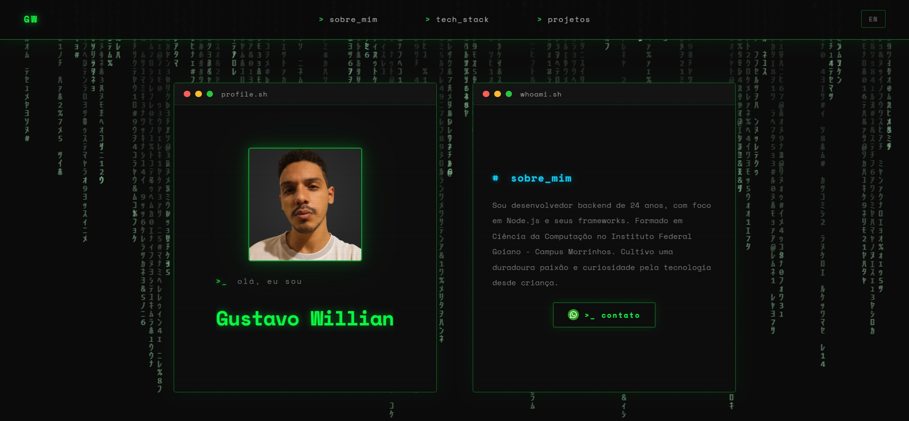

# Meu Portfólio Pessoal ✨

[](https://reactjs.org/)
[](https://www.typescriptlang.org/)
[](https://vitejs.dev/)
[](https://github.com/css-modules/css-modules)

> Repositório do meu portfólio pessoal, desenvolvido para exibir minhas habilidades e projetos.

<br>

<div align="center">
    
</div>

<p align="center">
  <a href="https://portfolio-roan-omega-n3sv1b6jhn.vercel.app/" target="_blank">
    
  </a>
</p>

## 📋 Índice

- [Sobre o Projeto](#-sobre-o-projeto)
- [Funcionalidades](#-funcionalidades)
- [Tecnologias Utilizadas](#-tecnologias-utilizadas)
- [Como Rodar o Projeto](#-como-rodar-o-projeto)
- [Estrutura do Projeto](#-estrutura-do-projeto)
- [Contato](#-contato)

## 🎯 Sobre o Projeto

Este é o repositório do meu portfólio pessoal, um lugar central para apresentar minha jornada como desenvolvedor, as tecnologias que domino e os projetos dos quais me orgulho. Foi construído com foco em um design limpo, responsivo e com interações suaves para proporcionar uma ótima experiência ao visitante.

## ✨ Funcionalidades

- ✅ **Header Fixo:** Navegação intuitiva que acompanha o scroll do usuário.
- ✅ **Seção Hero:** Apresentação com uma saudação animada (efeito de digitação) e um resumo sobre mim.
- ✅ **Tech Stack:** Uma grade responsiva e visual com os ícones das tecnologias que utilizo.
- ✅ **Projetos:** Cards detalhados para cada projeto, com links diretos para o código-fonte no GitHub e a demonstração ao vivo.
- ✅ **Animações Sutis:** Transições suaves e efeitos que melhoram a experiência de navegação.
- ✅ **Design Responsivo:** Totalmente adaptado para visualização em desktops, tablets e smartphones.

## 🛠️ Tecnologias Utilizadas

As seguintes ferramentas e tecnologias foram usadas na construção do projeto:

| Ferramenta      | Descrição                                             |
| --------------- | ----------------------------------------------------- |
| **React**       | Biblioteca para construir a interface de usuário.     |
| **TypeScript**  | Superset do JavaScript que adiciona tipagem estática. |
| **Vite**        | Ferramenta de build moderna e extremamente rápida.    |
| **CSS Modules** | Para estilização modular e escopada por componente.   |

## 🚀 Como Rodar o Projeto

Siga os passos abaixo para executar o projeto em seu ambiente local:

```bash
# 1. Clone este repositório
git clone https://github.com/GustavoWillian7/portfolio

# 2. Navegue até o diretório do projeto
cd portfolio

# 3. Instale as dependências
npm install
# ou
yarn install

# 4. Execute a aplicação em modo de desenvolvimento
npm run dev
# ou
yarn dev

# O servidor de desenvolvimento iniciará em http://localhost:5173 (ou outra porta disponível)
```
